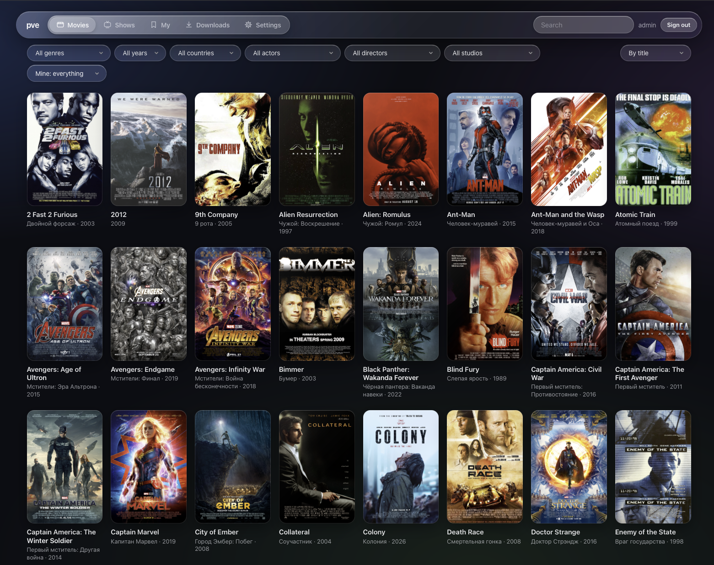
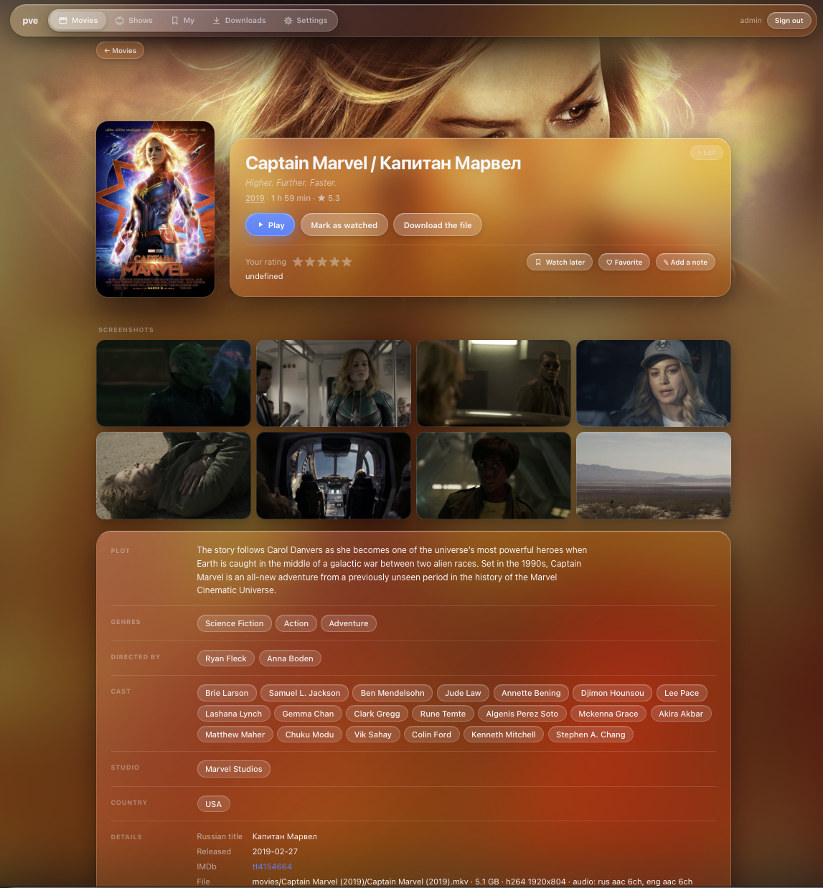
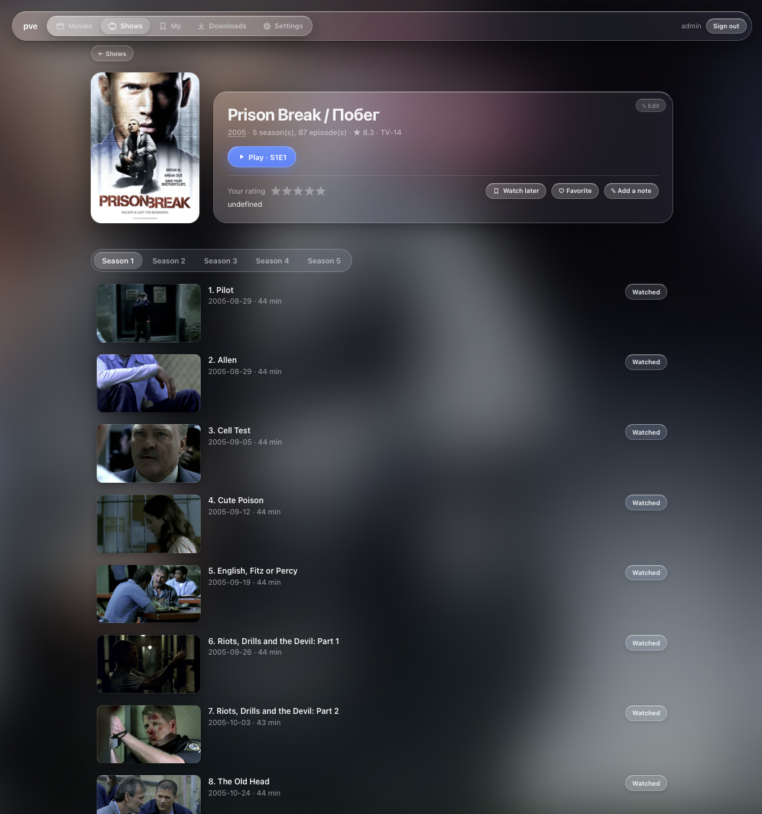
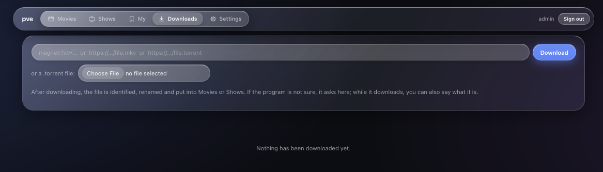

<h1 align="center">MediaKeeper</h1>

<p align="center">
  <b>Your movie and series folder, organized and served: a web player, a Jellyfin-compatible server, DLNA for TVs and a torrent downloader in one small binary.</b>
</p>

<p align="center">
  <a href="https://hub.docker.com/r/crashntech/mediakeeper"></a>
  
  
  
  <a href="LICENSE"></a>
</p>

<p align="center">
  
</p>

---

MediaKeeper turns a folder of downloaded movies and series — with names like
`Myatezh.2025.AMZN.WEB-DLRip.AVC.mkv` — into a properly named, described
library, and then serves it to every screen in the house.

- **It organizes.** It identifies each file in online catalogues (TMDB, OMDb,
  Kinopoisk, TVMaze, Wikidata, IMDb, Letterboxd), renames and files it the
  way Jellyfin, Kodi and Plex expect, writes `.nfo` files, downloads posters
  and backdrops and writes tags into the video files. Every run can be undone.
- **It serves.** One port gives a modern web interface with a player, an API
  that **Jellyfin apps** (Swiftfin, Infuse, Findroid, Jellyfin for Android TV…)
  connect to as if it were a Jellyfin server, and a **DLNA** server that smart
  TVs find on their own.
- **It downloads.** Paste a magnet link, a `.torrent` or a direct link: the
  file is downloaded, identified, renamed and put into the library.

## Contents

- [Features](#features)
- [Screenshots](#screenshots)
- [Quick start](#quick-start)
- [Organizing a library](#organizing-a-library)
- [The media server](#the-media-server)
  - [Web interface](#web-interface) · [Jellyfin apps](#jellyfin-apps) · [DLNA](#dlna) · [Downloads](#downloads) · [Users](#users) · [Playback and transcoding](#playback-and-transcoding)
- [Configuration](#configuration)
  - [Settings page](#settings-page) · [Environment variables](#environment-variables) · [Command-line options](#command-line-options) · [`config.yaml`](#configyaml) · [Where files are kept](#where-files-are-kept)
- [Metadata sources and API keys](#metadata-sources-and-api-keys)
- [Docker](#docker)
- [Building from source](#building-from-source)
- [License](#license)

## Features

**Library organizer**

- Recognizes movies and series from messy release names: release junk is
  ignored, transliterated titles (`Myatezh` → `Мятеж`) are tried in Cyrillic,
  multi-episode files (`s01e01-02`) are understood.
- Renames to `Movies/Title (Year)/Title (Year).mkv` and
  `Shows/Series (Year)/Season 01/Series S01E01 - Episode.mkv`; subtitles and
  other files with the same name follow the video.
- Writes Kodi/Jellyfin `.nfo` files, `poster.jpg`, `backdrop.jpg`, season
  posters and episode stills, and embeds the title, plot, genres and cover
  into MKV and MP4 files.
- Asks only when it is not sure: pick from a list, type another title, or
  paste an IMDb number or a link. Nothing is overwritten, and `-undo` puts
  everything back.

**Media server**

- A fast web interface for desktop and phone: filters by genre, year,
  country, people, studio and collection; sorting by title, release date
  (to watch a film series in order), date added or rating; search.
- A player that plays anything: files the browser cannot play (AVI, HEVC,
  AC3, DTS…) are converted on the fly, with seeking, audio track and
  subtitle selection, and optional hardware transcoding (VA-API, Quick Sync,
  NVENC).
- **Jellyfin API** for native Jellyfin apps on iPhone, iPad, Apple TV,
  Android and Android TV: libraries, search, resume, next up, watched state,
  direct play or HLS transcoding, subtitles.
- **DLNA / UPnP** server with automatic discovery for smart TVs and players.
- **Downloads** of torrents, magnet links and direct links, identified and
  filed automatically; unclear ones wait for your decision.
- **Several users**: administrators and viewers, each with their own
  progress, star ratings, watchlist, favorites, notes and viewing history.
- Metadata editing in the browser: descriptions, artwork, episodes,
  re-identifying a wrongly recognized title.
- Screenshots for every movie and stills for episodes, taken by ffmpeg.
- A first-start wizard and a settings page: no config file to edit.

**Small and self-contained**

- One static Go binary (no cgo) for Linux (amd64, arm64, armv7), macOS and
  Windows, and a Docker image for amd64 and arm64.
- Data lives in a single SQLite file; the library itself stays plain files
  and folders that any other media center can read.

## Screenshots

<table>
  <tr>
    <td width="50%"></td>
    <td width="50%"></td>
  </tr>
  <tr>
    <td align="center">A movie: description, screenshots, your rating and watchlist</td>
    <td align="center">A series: seasons, episodes with stills, watched marks</td>
  </tr>
  <tr>
    <td colspan="2"></td>
  </tr>
  <tr>
    <td colspan="2" align="center">Downloads: a magnet link, a torrent or a direct link becomes a title in the library</td>
  </tr>
</table>

## Quick start

### Docker (recommended)

The image contains MediaKeeper together with ffmpeg, mkvtoolnix and aria2.
Take [`deploy/docker-compose.yaml`](deploy/docker-compose.yaml), check the
`user` (the owner of your media folder: `id -u`, `id -g`) and the library
path, then:

```sh
mkdir -p config && sudo chown 1000:1000 config   # once: writable by the container's user
docker compose up -d
docker compose logs -f
```

Open `http://<host>:8200/`. The **first-start wizard** asks for:

1. the administrator's name and password;
2. the library folders (picked from the server's folders; `/media` in the example);
3. where the database and the screenshots are kept;
4. the server name, the language and catalogue API keys (optional).

Nothing is written to disk until the wizard is finished. Everything can be
changed later under **Settings**.

### Binary

Download the archive for your system from the [Releases](../../releases)
page and unpack it. Optional tools add features: `ffmpeg`/`ffprobe`
(playback of any format, screenshots, durations), `mkvtoolnix` (tags in MKV
files) and `aria2` (torrents).

```sh
sudo apt install ffmpeg mkvtoolnix aria2      # Debian, Ubuntu
brew install ffmpeg mkvtoolnix aria2          # macOS

./mediakeeper -serve                          # start the server, then open http://localhost:8200/
./mediakeeper -dry-run /path/to/media         # or: see how a folder would be organized
```

## Organizing a library

```sh
mediakeeper -dry-run /path/to/media     # show the plan, change nothing
mediakeeper /path/to/media              # identify, confirm, apply
mediakeeper -undo /path/to/media        # put everything back
```

The folder is scanned recursively. Every movie and series is looked up by
the title and year taken from its file name. A confident match is accepted
silently; otherwise MediaKeeper asks:

```
╭─ What is this? ────────────────────────────────────────────────────────────╮
│ File: Myatezh.2025.AMZN.WEB-DLRip.AVC.mkv                                  │
│ Guessed: movie "Myatezh" (2025)                                            │
├────────────────────────────────────────────────────────────────────────────┤
│ OMDb:                                                                      │
│    1) Myatezh (1929)                                                       │
│ Wikidata:                                                                  │
│    2) Мятеж (2026) — Mutiny                                                │
│ IMDb:                                                                      │
│    3) Mutiny (2026)                                                        │
├────────────────────────────────────────────────────────────────────────────┤
│ a number     pick an entry from the list                                   │
│ a title      search all sources; any language, a year helps: Форсаж 2026   │
│ tt0371746    IMDb number;  also tmdb:1726, kp:61237, tvmaze:714            │
│ a link       to IMDb, TMDB, Kinopoisk, Letterboxd or TVMaze                │
│ s  skip      q  quit                                                       │
╰────────────────────────────────────────────────────────────────────────────╯
```

When every file is identified the full plan is shown, and nothing is touched
until you confirm it:

```
media/                                      media/
├── Iron Man (2008) IMAX.mkv                ├── Movies/
├── Myatezh.2025.AMZN.WEB-DLRip.AVC.mkv     │   ├── Iron Man (2008)/
├── На линии огня.mkv                 →     │   │   ├── Iron Man (2008).mkv
└── Startrek/                               │   │   ├── Iron Man (2008).nfo
    ├── Star.Trek.Enterprise.s1e01-02….mkv  │   │   ├── poster.jpg
    └── Star.Trek.Enterprise.s2e01….mkv     │   │   └── backdrop.jpg
                                            │   ├── In the Line of Fire (1993)/
                                            │   └── Mutiny (2026)/
                                            └── Shows/
                                                └── Star Trek - Enterprise (2001)/
                                                    ├── tvshow.nfo, poster.jpg
                                                    ├── Season 01/
                                                    │   └── Star Trek - Enterprise S01E01-E02 - Broken Bow.mkv
                                                    └── Season 02/
```

Good to know:

- **Nothing is overwritten.** If the target name is taken, the file stays
  where it is and the plan says so.
- **Described files are left alone.** A video that already has an `.nfo`
  (from MediaKeeper, Jellyfin, Kodi or written by hand) is not renamed or
  looked up again, so a second run only handles new files. `-refresh` redoes
  everything.
- **Titles stay in their folder.** `Movies/` and `Shows/` are created where
  the files were found; `-out DIR` gathers the library elsewhere instead.
- **`-undo`** restores names and folders and removes what the run created.
  Tags written into files cannot be undone — use `-no-tags` while trying it
  out. `-yes` runs without questions (unclear files are skipped), for cron.

### Several library folders

A library can be spread over several disks or shares, each holding movies,
series, or both:

```sh
mediakeeper /srv/media                                     # both: Movies/ and Shows/ inside
mediakeeper -movies /srv/movies -movies /mnt/disk2/films   # movies only
mediakeeper -movies /srv/movies -shows /srv/series /srv/media
```

A folder of movies gets `Title (Year)/` right inside, a folder of series
`Series (Year)/Season NN/`. Titles never move between folders, and each
folder has its own undo journal. The server shows all folders together;
new downloads go to the first folder of the right kind. The folders chosen
in the web interface (**Settings → Library**) are used whenever none is
given on the command line.

## The media server

```sh
mediakeeper -serve                                  # the folders chosen under Settings
mediakeeper -serve /path/to/media                   # or given here (then locked in Settings)
mediakeeper -serve -port 8300 -name "Living room"
```

One port (8200 by default) serves the web interface, the Jellyfin API and
DLNA. New files appear without a restart. Titles, descriptions and artwork
come from the `.nfo` and image files, so an organized library looks best,
but unorganized files are listed too.

The server speaks plain HTTP. To use it over the internet, put it behind a
reverse proxy with TLS (Caddy, nginx, Traefik).

### Web interface

- **Movies** and **Shows**: posters with filters (genre, year, country,
  actor, director, writer, studio, collection, your own marks) and sorting
  (by title, oldest or newest first, recently added, best rated, your
  rating). The search narrows the posters and stays while you sort and filter.
- **Title pages**: plot, cast, crew, studio and country, each a link to
  everything else in the library that shares it; a collection page lists a
  film series in release order. Movies get eight screenshots; episodes get
  stills.
- **My**: what you are watching (**Continue**), your **Watchlist**,
  **History** (every sitting by day, with the time really watched), titles you
  **Rated** and your **Favorites**. Ratings use half-stars; notes are private.
- **Editing** (administrators): the description, poster, backdrop, season
  posters and episodes of any title, written back into the `.nfo` and the
  file tags. **Fill in from a catalogue…** re-identifies a wrongly recognized
  title and can rename its files accordingly. Artwork that could not be
  downloaded at the time is taken again from the catalogue entry the
  description names — for one title in its **Images** tab, or for the whole
  library under **Settings → Library → Artwork**.
- Works on phones: a bottom tab bar, touch-friendly player controls.

### Jellyfin apps

Add `http://<host>:8200` as a server in the app and sign in with a
MediaKeeper account. Supported: sign-in, the Movies and Shows libraries,
search, series → seasons → episodes, artwork, direct play, transcoding to
HLS with seeking, audio and subtitle tracks, watched state, resume and next up.

| App | Platforms | Status |
|---|---|---|
| [Swiftfin](https://github.com/jellyfin/Swiftfin) | iPhone, iPad, Apple TV | ✅ tested |
| [Infuse](https://firecore.com/infuse) | iPhone, iPad, Apple TV, Mac | ✅ expected to work |
| [Findroid](https://github.com/jarnedemeulemeester/findroid) | Android | ✅ expected to work |
| [Jellyfin for Android TV](https://github.com/jellyfin/jellyfin-androidtv) | Android TV, Fire TV | ✅ expected to work |
| [Jellyfin for Kodi](https://github.com/jellyfin/jellyfin-kodi) | Kodi | ✅ expected to work |

How it works and what to expect:

- **Direct play or transcoding.** An app tells the server which containers
  and codecs its player supports. Files it supports are sent as they are;
  others (Matroska for the Apple TV player, for example) are converted to
  HLS on the fly — H.264 is copied when possible, audio becomes AAC — with
  the whole film in the playlist, so seeking works anywhere.
- **Subtitles.** Text tracks and `.srt` files are offered to the app; picture
  subtitles (PGS, DVD) that its player cannot draw are burned into the video.
- **Native apps only.** The official *Jellyfin for Android/iOS* and *Jellyfin
  Media Player* are wrappers around Jellyfin's own web client, which
  MediaKeeper does not include.
- **A subset of the API.** The server presents itself as Jellyfin 12.0.0.
  Requests it does not implement are logged once as
  `Jellyfin API: not supported: …`; `-debug` logs every request in full.

### DLNA

Smart TVs and players on the same network find the server by themselves
(SSDP). It offers **Movies**, **Shows** (series → season → episodes) and
**Folders** as on disk, with `.srt` subtitles. Files are served as they are,
without transcoding.

DLNA has no logins: anyone on the local network can browse and watch. Turn it
off under **Settings → Server** or with `-dlna=false`. The firewall has to
allow the HTTP port (8200/tcp) and 1900/udp.

### Downloads

Administrators can download on the **Downloads** page:

- a **magnet link** or a **`.torrent`** file (uploaded or by URL), via
  [aria2](https://aria2.github.io/), which MediaKeeper starts and controls
  itself — nothing to configure. Nothing is seeded after the download;
- a **direct `http(s)` link** to a video file.

A finished download is identified like on the command line and moved into
the library with its `.nfo` and artwork. **Save to** decides where: a library
folder you choose — shown with the free space on its disk — or automatically,
each title to the first folder of its kind. A chosen folder is used for
whatever the download turns out to be, so you can send it where there is
room; it is also downloaded on that folder's disk. The choice can be changed
until the download is filed. A download of several videos sent to a folder
of series, or said to be a series, is filed as one series: even files that
are only numbered (`01.avi`, `Серия 5.mkv`) become its episodes.

When MediaKeeper is not sure, the download is marked **Needs you** and shows
the candidates from all catalogues; you can also search by another title or
paste an IMDb link.
While a download is still running, **Say what it is…** decides the title in
advance. Downloads in progress are kept in `.incoming` inside the chosen
library folder (the first one when the choice is automatic).

### Users

| Role | Can |
|---|---|
| Administrator | everything: downloads, editing, settings, users |
| Viewer | browse and watch; has their own progress, ratings, watchlist and history |
| Guest (no login) | browse and watch in the web interface; nothing is remembered. Can be turned off |

The first administrator is created by the first-start wizard (or with
`MEDIAKEEPER_ADMIN_PASSWORD`, which also resets a forgotten password). More
accounts are added under **Settings → Users**; the same name and password
work in Jellyfin apps. The Jellyfin API always needs an account. Passwords
are stored as salted PBKDF2 hashes.

### Playback and transcoding

The web player sends a file as it is when the browser can play it
(MP4/WebM/Matroska with H.264, VP9 or AV1 and AAC, MP3 or Opus). Anything
else is converted by ffmpeg while it plays: Safari gets HLS, other browsers a
stream. At most two conversions run at a time. The player has its own
controls (seeking, audio tracks, subtitles, picture in picture, full screen)
and remembers the position for each user; a series continues with the next
episode.

**Subtitles**: text tracks inside the file (SubRip, ASS) and `.srt` files
next to it are shown over any stream. Picture subtitles (Blu-ray PGS, DVD)
are burned into a converted stream. The chosen language is remembered.

**Hardware transcoding** moves the heavy work (HEVC, 10-bit, interlaced
video) to a graphics card:

| Value | Uses |
|---|---|
| `none` (default) | the processor (libx264) |
| `auto` | the first of the following that works |
| `vaapi` or `vaapi:/dev/dri/renderD129` | Intel or AMD through VA-API |
| `qsv` | Intel Quick Sync |
| `nvenc` | NVIDIA (ffmpeg built with NVENC) |

Set it under **Settings → Server**, with `-hwaccel` or `MEDIAKEEPER_HWACCEL`.
At start the server encodes a test picture on the card and uses it only if
that works; a file the card fails on falls back to the processor. The Docker
image includes Intel drivers; for AMD build it with
`--build-arg EXTRA_PACKAGES=mesa-va-gallium`. Alpine's ffmpeg has no NVENC,
so for NVIDIA run the binary on the host.

## Configuration

### Settings page

All settings live in the database and are changed in the web interface under
**Settings** (administrators only). Most changes apply immediately; the port
and DLNA need a restart, and the page says so.

| Tab | Settings |
|---|---|
| Library | library folders and what each holds (movies, series, both), their order; downloading missing artwork for the whole library |
| Descriptions | TMDB, OMDb and Kinopoisk API keys, language, sources and their order, a TMDB mirror |
| Server | name, port, watching without signing in, DLNA, tags in downloaded files, hardware transcoding, screenshot folder, database location |
| Users | accounts and roles |

**Command-line flags and environment variables take precedence** over the
saved settings: a setting given that way is shown locked on the page, with
what sets it. The order is: flags › environment variables › saved settings ›
defaults.

### Environment variables

| Variable | Meaning | Default |
|---|---|---|
| `MEDIAKEEPER_CONFIG` | Folder for `config.yaml` and the database (or a path to a `.yaml` file) | next to the program; `/config` in Docker |
| `MEDIAKEEPER_DB` | The database file (or a folder for `mediakeeper.db`) | `mediakeeper.db` next to `config.yaml` |
| `MEDIAKEEPER_CACHE` | Folder for screenshots, episode stills and extracted subtitles | `.cache` in the first library folder |
| `MEDIAKEEPER_HWACCEL` | Hardware transcoding: `none`, `auto`, `vaapi[:device]`, `qsv`, `nvenc` | `none` |
| `MEDIAKEEPER_ADMIN` | Name of the administrator made from `MEDIAKEEPER_ADMIN_PASSWORD` | `admin` |
| `MEDIAKEEPER_ADMIN_PASSWORD` | Creates that administrator at start, or resets their password | — |
| `MEDIAKEEPER_DEBUG` | `1`: log every Jellyfin request, in full in `jellyfin-debug.log` | off |
| `TMDB_API_KEY` | TMDB API key | — |
| `OMDB_API_KEY` | OMDb API key | — |
| `KINOPOISK_API_KEY` | Kinopoisk (kinopoiskapiunofficial.tech) API key | — |
| `HTTPS_PROXY`, `HTTP_PROXY` | Proxy for catalogue requests | — |
| `NO_COLOR` | Terminal output without colors | — |
| `TZ` | Time zone of the log (Docker) | UTC |

### Command-line options

```
mediakeeper [options] [folder ...]
```

Without folders, the library folders from the settings are used, else the
current directory.

| Option | Meaning |
|---|---|
| `-serve` | Run the media server instead of organizing |
| `-dry-run` | Show the plan, change nothing |
| `-yes` | Ask nothing: skip unclear files and apply the plan |
| `-undo` | Revert the last run in each folder; repeat to go further back |
| `-movies DIR` | A library folder of movies only; may be repeated |
| `-shows DIR` | A library folder of series only; may be repeated |
| `-out DIR` | Build the library in `DIR` instead of where the files are |
| `-refresh` | Also redo videos that already have an `.nfo` |
| `-no-tags` | Do not write tags into files |
| `-sources LIST` | Comma-separated sources in priority order, e.g. `tmdb,tvmaze,omdb` |
| `-lang CODE` | Language of TMDB titles and descriptions, e.g. `ru-RU` (default `en-US`) |
| `-setup` | Enter API keys in the terminal, save them and exit |
| `-port N` | With `-serve`: HTTP port (default 8200) |
| `-name NAME` | With `-serve`: the name apps and TVs show (default: the host name) |
| `-dlna=false` | With `-serve`: no DLNA server |
| `-guests=false` | With `-serve`: require signing in to watch in the web interface |
| `-hwaccel WAY` | With `-serve`: hardware transcoding (see above) |
| `-cache DIR` | With `-serve`: folder for screenshots and stills |
| `-db FILE` | The database file (or a folder for it) |
| `-config DIR` | Folder for `config.yaml` and the database (or a `.yaml` file) |
| `-debug` | With `-serve`: log Jellyfin requests in full |
| `-version` | Print the version |

### `config.yaml`

Settings are kept in the database, so `config.yaml` is normally not needed at
all. It only appears when the database has been moved away from its default
place (in the wizard or under **Settings → Server**): the file then tells the
next start where the database is.

```yaml
server:
  database: /var/lib/mediakeeper/mediakeeper.db
```

It is also a way to import settings: anything else written into it is taken
into the database at the next start, after which the file is cleared (the
original is kept as `config.yaml.old`). Settings files of earlier versions
are imported the same way. The recognized keys:

```yaml
tmdb_api_key: "..."
omdb_api_key: "..."
kinopoisk_api_key: "..."
language: ru-RU                       # language of TMDB titles and descriptions
sources: [tmdb, tvmaze, omdb, kinopoisk, wikidata, imdb, letterboxd]
tmdb_api_url: https://api.themoviedb.org/3          # a TMDB mirror, if TMDB is blocked
tmdb_image_url: https://image.tmdb.org/t/p/original

libraries:
  - /srv/media                        # both: Movies/ and Shows/ inside
  - path: /mnt/disk2/films
    kind: movies                      # movies only
  - path: /mnt/disk2/series
    kind: shows                       # series only

server:
  name: Living room                   # default: the host name
  port: 8200
  dlna: true                          # DLNA has no login
  guests: true                        # watch the web interface without signing in
  no_tags: false                      # do not tag downloaded files
  hwaccel: auto                       # none, auto, vaapi, qsv, nvenc
  cache: /var/cache/mediakeeper       # screenshots and stills
  database: /var/lib/mediakeeper/mediakeeper.db   # stays in the file
```

### Where files are kept

| What | Default location |
|---|---|
| `mediakeeper.db` — settings, accounts, progress, ratings, history | next to the program; `~/.config/mediakeeper/` if that folder is not writable; `/config` in Docker |
| `config.yaml` | in the same folder (only when needed, see above) |
| Screenshots, stills, extracted subtitles | `.cache/` in the first library folder |
| Downloads in progress | `.incoming/` in the first library folder |
| Undo journals | `.mediakeeper/` in each library folder |
| `.nfo`, `poster.jpg`, `backdrop.jpg`, `seasonNN-poster.jpg`, `*-thumb.jpg` | next to the videos, the Jellyfin/Kodi way |

The database is written as things happen, so nothing is lost if the server
stops abruptly. To back it up while the server runs:
`sqlite3 mediakeeper.db ".backup copy.db"`.

## Metadata sources and API keys

| Source | Key | Movies | Series | Language | Notes |
|---|:---:|:---:|:---:|---|---|
| `tmdb` | yes | ✓ | ✓ | any (`-lang`) | The richest data: descriptions, artwork, cast, collections |
| `tvmaze` | — | | ✓ | English | Episode titles, stills, season posters |
| `omdb` | yes | ✓ | ✓ | English | IMDb data and ratings |
| `kinopoisk` | yes | ✓ | ✓ | Russian | Via kinopoiskapiunofficial.tech |
| `wikidata` | — | ✓ | ✓ | search | Finds titles by their Russian name |
| `imdb` | — | ✓ | ✓ | search | Finds titles; details come from other sources |
| `letterboxd` | — | ✓ | | English | Film pages by link, IMDb number or exact title |

MediaKeeper works without any keys. The free keys give much better results:

- TMDB — <https://www.themoviedb.org/settings/api>
- OMDb — <https://www.omdbapi.com/apikey.aspx>
- Kinopoisk — <https://kinopoiskapiunofficial.tech>

Enter them in the wizard, under **Settings → Descriptions**, with
`mediakeeper -setup`, or in environment variables. Sources are asked in
priority order: the first confident match names the file, the others fill in
what it lacks. A source without a key, or unreachable, is skipped. When the
data is not in Russian, the Russian title is looked up in Wikidata and shown
next to the original one.

## Docker

The image (`crashntech/mediakeeper`, linux/amd64 and linux/arm64) runs the
server by default and keeps its data in `/config`. A complete example with
comments is in [`deploy/docker-compose.yaml`](deploy/docker-compose.yaml):

```yaml
services:
  mediakeeper:
    image: crashntech/mediakeeper:latest
    container_name: mediakeeper
    restart: unless-stopped
    network_mode: host            # needed for DLNA discovery
    user: "1000:1000"             # the owner of the media folder
    environment:
      TZ: Europe/Moscow
      # MEDIAKEEPER_HWACCEL: auto
    # devices: ["/dev/dri:/dev/dri"]   # a graphics card for hardware transcoding
    volumes:
      - ./media:/media
      - ./config:/config
    command: ["-serve"]
    stdin_open: true              # for "docker compose run" dialogs
    tty: true
```

- **Permissions.** Everything the container writes — the database, downloads,
  renamed files, the cache — must be writable by `user`. A folder that Docker
  creates by itself belongs to root, so create `config` first and `chown` it.
- **Networking.** DLNA discovery uses multicast, which does not pass Docker's
  bridge network: use `network_mode: host` (Linux only). Without DLNA, add
  `-dlna=false` to the command and map `ports: ["8200:8200"]` instead.
- **More library folders.** Mount them as more volumes (`/mnt/disk2/films:/films`)
  and add them under **Settings → Library**.
- **Hardware transcoding.** Pass `/dev/dri`, add the host's `render` group
  (`group_add`) and set `MEDIAKEEPER_HWACCEL: auto`.
- **Upgrading** from versions that kept settings in `config.yaml` or used
  `/config/mediakeeper`: everything is picked up automatically.

Organizing files that are already on disk is interactive, so it runs in a
one-off container sharing the service's volumes and settings:

```sh
docker compose run --rm mediakeeper -dry-run /media     # show the plan
docker compose run --rm mediakeeper /media              # identify and organize
docker compose run --rm mediakeeper -undo /media        # revert the last run
```

With plain `docker run`, keep `-it` for the dialogs and `--user` for file
ownership:

```sh
docker run --rm -it --user "$(id -u):$(id -g)" \
  -v /path/to/media:/media -v /path/to/config:/config \
  crashntech/mediakeeper /media
```

## Building from source

Go 1.24 or newer; no C compiler is needed (SQLite is a pure Go package).

```sh
go build -o mediakeeper .      # the web interface is embedded into the binary
go test ./...
docker build -t mediakeeper .
```

How the program is put together is described in
[docs/ARCHITECTURE.md](docs/ARCHITECTURE.md).

## License

MediaKeeper is released under the [MIT License](LICENSE).
