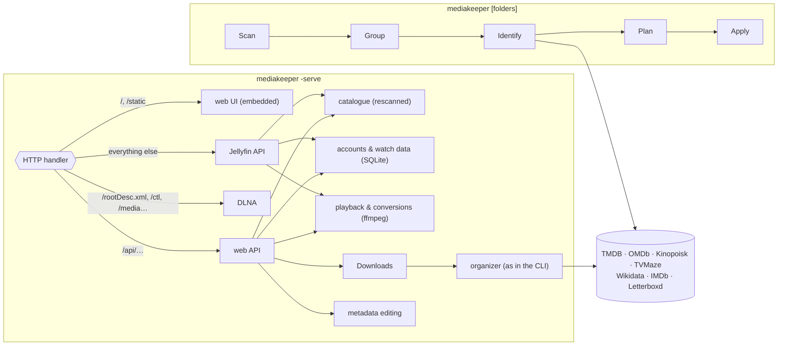

# MediaKeeper architecture

MediaKeeper is a single Go program (package `main`, no cgo) with two modes:

- **the organizer** — `mediakeeper [folders]`: finds videos, identifies them
  in online catalogues, renames and files them, writes `.nfo`, artwork and
  tags, and records everything in an undo journal;
- **the server** — `mediakeeper -serve`: one HTTP port with a web interface,
  a Jellyfin-compatible API, DLNA, and downloads that are organized as they
  finish, reusing the organizer.

## 1. Library folders

A library is one or more folders (`Root{Path, Kind}`, `roots.go`):

| Kind | Holds | Filing |
|---|---|---|
| *(empty)* | movies and series | `Movies/Title (Year)/…`, `Shows/Show (Year)/Season NN/…` inside |
| `movies` | movies only (an episode-like name is still a movie) | `Title (Year)/…` right inside |
| `shows` | series only | `Show (Year)/Season NN/…` right inside |

Folders come from the command line (positional = mixed, `-movies`, `-shows`;
positional ones first), or from `libraries:` in the settings. Titles never
move between folders; each folder has its own undo journal. The **first
folder** is special: downloads in progress (`.incoming/`) and, unless
chosen otherwise, the cache (`.cache/`) live in it, and its titles keep the identifiers they had before
multiple folders existed (empty `rootKey`).

## 2. The organizer

1. **Scan** (`scan.go`): walks a folder (skipping dot-folders), collects
   videos with their sidecars (same base name: subtitles, extra audio), and
   parses each path into a `Guess` (`parse.go`: title, year, season/episodes,
   release junk removed). `scanRoot` applies the folder's kind.
2. **Group**: files of one series (same normalized title, `SxxEyy`) form one
   `Unit`; every other file is a movie unit. Videos that already have an
   `.nfo` are left alone unless `-refresh`.
3. **Identify** (`identify.go`): an `.nfo` written by an earlier run carries
   `<!-- mediakeeper source=… id=… kind=… -->` and is reused. Otherwise the
   **Hub** (`model.go`) searches all available providers in priority order
   (title variants, transliteration to Cyrillic, the year as a hint);
   `autoPick` accepts a confident match, else an interactive dialog lists
   candidates and accepts a number, another title, an ID (`tt…`, `tmdb:`,
   `kp:`, `tvmaze:`) or a link. A provider without a key, unreachable or
   rejecting the key is switched off for the run. `localize` adds the
   Russian title from Wikidata when the data is not in Russian.
4. **Plan** (`plan.go`): `AddMovie`/`AddShow` produce `Item`s — a move, the
   sidecars' moves, documents (`.nfo`, `nfo.go`), images to download and tags
   to write. `library()` decides where a title belongs (it stays near where it
   was found; a folder holding nothing else is the title's own and moves as a
   whole, `relocate`), `category()` adds `Movies/`/`Shows/` in mixed folders.
   Nothing is overwritten: a taken name is a conflict.
5. **Apply**: executes the plan, recording every move, created file and
   overwritten file in a **journal** (`undo.go`, `<folder>/.mediakeeper/*.json`);
   `-undo` replays journals backwards. Tags (`tagger.go`) go into the files
   with `mkvpropedit` (Matroska, in place, cover as attachment) or ffmpeg
   (remux; MP4 gets the cover as an attached picture) — tags cannot be undone.

## 3. The server

`Serve` (`server.go`) builds a `Server`: the library folders, a `Library`
(the catalogue, rescanned at most every 30 s or on `refresh()`), the
`prober` (background ffprobe with a cache keyed by path+size+mtime), `Auth`
(SQLite), `Downloads`, the DLNA server, the HLS manager and the screenshot
maker. `Handler` routes by path:

| Path | Goes to |
|---|---|
| `/`, `/index.html`, `/static/…` | the embedded web UI (`web/`, `go:embed`) |
| `/api/…` | the web API (`web.go` and the handlers it dispatches to) |
| `/favicon.ico`, `/apple-touch-icon*` | the PNG icon |
| `/rootDesc.xml`, `/scpd/`, `/ctl/`, `/evt/`, `/media/`, `/art/`, `/sub/` | DLNA |
| anything else | the Jellyfin API (`jellyfin.go`), wrapped by `debug.go` with `-debug` |

### Catalogue (`catalog.go`)

`buildCatalog` scans every folder and turns files into `CatItem`s (movies
and episodes) and `CatShow`/`CatSeason`s, reading titles, plots, cast and
artwork from `.nfo` and image files. A series is the folder with
`tvshow.nfo`, else it is known by its guessed title. Identifiers are
`md5(kind + "\0" + rootKey + relative path)` as 32 hex digits (Jellyfin
clients parse IDs as GUIDs) — they follow file names.

### Accounts and personal data (`users.go`, `mine.go`)

One SQLite database, `mediakeeper.db` next to the settings (or `-db`,
`MEDIAKEEPER_DB`, `server.database`), opened with WAL and foreign keys;
pure-Go driver `modernc.org/sqlite`.

| Table | Contents |
|---|---|
| `meta` | `server_id` (Jellyfin apps know the server by it) |
| `users` | id, name (unique, case-insensitive), PBKDF2-SHA256 hash, admin |
| `sessions` | login tokens (web cookie `mk_token`, Jellyfin tokens) |
| `watch` | per user × title (movie, episode or series): position, played, play count, favourite, last played, **rating** (1–10), **planned** (watchlist), **note** |
| `history` | sittings: item, series, a snapshot of titles/numbers, start/end, seconds really watched, position, finished |

Users, sessions and watch states are also kept in memory and written
through on every change; history is only in the database. A sitting
continues the last one of the same video if resumed within 30 minutes;
"watched" grows only by played progress (not pauses or jumps ahead). A
`server.json` of an earlier version is imported once. Guests (web UI without
signing in, cookie `mk_guest`) are users without an account: nothing is
stored for them. When the server renames files, `Server.moved` maps old item
and series IDs to new ones and `Auth.Moved` rewrites `watch` and `history`.

### Web UI (`web/static/app.js`, `style.css`)

A single-page app in plain JavaScript without a build step. Routing is the
URL hash (`#movies?genre=…`, `#movie/{id}`, `#show/{id}`, `#mine/history`,
`#downloads`, `#users`); `render()` loads `/api/library` and draws pages
with the `h()` helper. Main parts: catalogue grids with facet filters (genre,
year, people, studio, "Mine"), title pages (hero with backdrop, screenshots,
details, the user's rating/watchlist/favourite/note), the player, the edit
sheet for administrators (description with "fill in from a catalogue",
images, episodes), downloads, users, and the "My" page (continue, watchlist,
history with statistics, rated, favourites).

### Playback

| Client | File the client plays | How |
|---|---|---|
| Browser, file it can play | the original | `/api/stream/{id}` with Range |
| Browser, other files | fMP4 made on the fly | `/api/transcode/{id}?start=` — seeking starts a new stream |
| Safari (web) | growing HLS | `/api/hls/start` → session → playlist + `.ts` segments (`hls.go`) |
| Jellyfin app, file its device profile takes | the original | `/Videos/{id}/stream` with a play session |
| Jellyfin app, other files | whole-film HLS | `TranscodingUrl` → `/Videos/{id}/master.m3u8` → `vod.go` |
| DLNA renderer | the original | `/media/…` with Range |

`convertArgs` is shared: H.264 (not 10-bit, not interlaced) is copied, other
video is re-encoded with libx264 (bwdif for interlaced), audio becomes stereo
AAC. At most two conversions run at once (`Server.transcodes`); a viewer's
new stream ends their previous one (`viewerStreams`), and a slot is waited
for up to 10 s.

- **Growing HLS** (`hls.go`): ffmpeg's `hls` muxer writes an EVENT playlist.
  `EXT-X-TARGETDURATION` is fixed per session (Safari gives up when it
  changes); ffmpeg is paused (SIGSTOP) when far ahead of the viewer; idle
  sessions end after 3 minutes. Seeking past what is made starts a new
  session.
- **Whole-film HLS** (`vod.go`): the playlist lists every segment with its
  exact length from the start (`PLAYLIST-TYPE:VOD`, `ENDLIST`), so native
  players show a seek bar. Segments are made on demand by the `segment`
  muxer; a request beyond what the current run will reach soon restarts
  ffmpeg at that segment. All runs cut at the same times: a re-encoded track
  every 6 s (`-force_key_frames` on the run's own clock, runs start on the
  grid), a copied track at key frames read from the Matroska index
  (`mkvcues.go`, EBML Cues, a few ms per file). ffmpeg keeps source time
  stamps (`-copyts`), so segments of different runs fit together. Files
  without an index fall back to the growing playlist.
- **Web player controls**: for converted video the browser's controls cannot
  seek, so the player shows its own (play, slider, sound, picture in picture,
  full screen of the whole player), over the picture and fading while it
  plays.

### Jellyfin API (`jellyfin.go`, `jellyfin_play.go`)

A subset of the Jellyfin API (reported version `12.0.0`), routed through a
case-insensitive pattern table (`jfR`, `jfPublic`); unknown requests are
logged once. Entries are views (Movies, Shows), movies, series, seasons and
episodes, rendered as Jellyfin DTOs with user data. Login accepts tokens in
`Authorization`/`X-Emby-Authorization`, `X-Emby-Token`, `X-MediaBrowser-Token`,
`api_key`. **PlaybackInfo** reads the app's device profile: a file its
`DirectPlayProfiles` take is offered as it is, any other as a
`TranscodingUrl`. It also issues a **play session** (24 h): the players
an app hands addresses to (AVPlayer, VLC) bring no token, and the play
session in the address opens that one item. `DELETE /Videos/ActiveEncodings`
ends the conversion.

### Metadata editing (`meta.go`, `meta_show.go`)

Administrators edit movies, series and episodes from the web UI. `.nfo`
files are edited as generic XML trees (`xmlNode`), replacing only the edited
elements and keeping everything else. "Fill in from a catalogue" loads an
entry into the form (`lookupMeta`) without saving; saving can download its
artwork and rename the files (a movie by `renameMovie`, a series by `fix`
with the hand-made changes laid over). Tags are rewritten in the background,
one job per set of files (`tagWriter`). Uploaded images are stored as JPEG.

### Downloads (`downloads.go`)

A download (HTTP link, torrent file or magnet; torrents via an `aria2c`
child process driven over JSON-RPC) lands in `.incoming/<id>/`. When it
finishes it is organized like on the command line (`Identify` with
`-yes`) and moved into the folder of its kind; what cannot be identified
with confidence waits on the Downloads page ("Needs you"). An
administrator can say what a download is while it is still running
(a preset). Finished downloads remember where their files went and follow
later renames.

### Screenshots and stills (`screens.go`)

A background worker takes eight screenshots per movie
(`<cache>/screenshots/<id>/`) and one still per episode without its own
(`<cache>/stills/<id>.jpg`), urgent requests first, pausing while someone
watches a converted video. Stale ones are pruned at start.

### DLNA (`dlna.go`, `dlna_library.go`, `ssdp.go`)

A UPnP MediaServer with ContentDirectory over SOAP: Movies, Shows (series →
seasons → episodes) and Folders (the folders as on disk), with Russian
titles next to the main ones. It has its own scan of the folders
(`buildLibrary`) and no login. SSDP announces it on every interface.

## 4. Settings and files

**Settings** (`config.go`): `config.yaml` is found at `-config`, else
`MEDIAKEEPER_CONFIG`, else next to the binary (when writable and not a
temporary `go run` build), else `~/.config/mediakeeper/`. Settings found in
the old place are moved next to the binary once. The file is rewritten whole
with comments by `-setup`; unknown keys are errors. Paths can be chosen by
flag, environment variable or setting, in that order of precedence
(`chosenPath`; relative paths in the settings are relative to its folder):
the database (`-db`, `MEDIAKEEPER_DB`, `server.database`) and the cache
(`-cache`, `MEDIAKEEPER_CACHE`, `server.cache`).

| Next to the settings | |
|---|---|
| `config.yaml` | keys, language, sources, libraries, `server:` options |
| `mediakeeper.db` (+ `-wal`, `-shm`) | accounts, watch data, history |
| `jellyfin-debug.log` | with `-debug` |

| In a library folder | |
|---|---|
| `.mediakeeper/*.json` | undo journals of runs in this folder |
| `.incoming/` (first folder) | downloads in progress, `downloads.json` |
| `.cache/screenshots/`, `.cache/stills/` (first folder) | generated images, unless `-cache`, `MEDIAKEEPER_CACHE` or `server.cache` puts them elsewhere |
| `*.nfo`, `poster.jpg`, `backdrop.jpg`, `seasonNN-poster.jpg`, `*-thumb.jpg` | descriptions and artwork, the Jellyfin/Kodi way |

Conversions use temporary folders `mediakeeper-hls-*`/`mediakeeper-vod-*`,
removed when a session ends.

## 5. Testing

Tests are in the same package and run offline: `fakeServices` imitates every
catalogue, `serverFixture` builds a server over a small library with two
users, and `newBrowser` is a cookie client. Tests that need ffmpeg, ffprobe
or mkvtoolnix (conversions, segment timing, screenshots, tags) skip without
them. The web UI is checked with a headless Chrome (puppeteer in Docker)
outside the test suite.

## 6. Build and release

`go build` embeds the web UI. CI builds for six platforms with
`CGO_ENABLED=0`, publishes a GitHub release for `v*` tags and a Docker
image for linux/amd64 and linux/arm64 (alpine with ffmpeg, mkvtoolnix and
aria2; settings in `/config`, library in `/media`).
